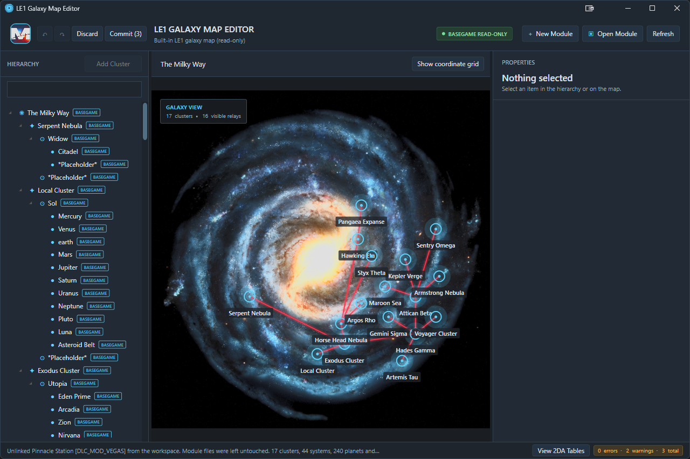
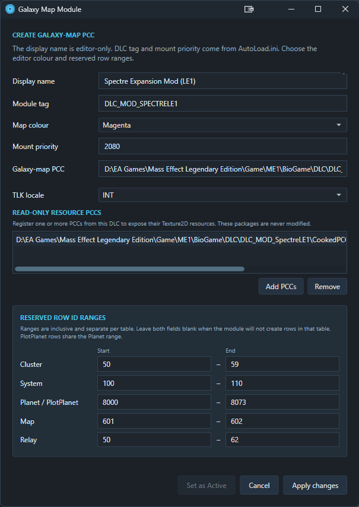

# Getting Started

This guide takes you from the release archive to your first committed galaxy-map edit.

## Requirements

- 64-bit Windows 10 or Windows 11.
- [.NET 10 Desktop Runtime](https://dotnet.microsoft.com/download/dotnet/10.0).

You need the Desktop Runtime, not the larger developer SDK. The runtime is not bundled with the application.

## First Startup

On first launch, the editor loads its built-in **BASEGAME READ-ONLY** data. On later launches it also restores the DLC module profiles remembered in your workspace.

## Create an authoring module

Before choosing **New Module**, create the DLC structure with ME3Tweaks Mod Manager. The DLC must contain:

- a valid `AutoLoad.ini` in the DLC root, with `ModName` and a non-negative `ModMount` under `[ME1DLCMOUNT]`;
- a `CookedPCConsole` folder directly beneath that root.
- A M3DA script for merging your 2DA tables (does not need to exist when working with this editor however, only when installing the mod).

Choose **New Module** and save the new `.pcc` directly inside `CookedPCConsole`. The editor reads the module tag from the DLC folder name and the display name and mount priority from `AutoLoad.ini`. Then complete the editor-owned settings:

| Field | What to enter |
|---|---|
| **Display name** | The readable name shown in the editor. This does not alter `AutoLoad.ini`. |
| **Map colour** | The colour used to identify this module's rows and values. |
| **TLK locale** | The locale used when displaying string references for this module. |
| **Resource PCCs** | Optional PCCs from the same DLC whose `Texture2D` exports should be available to previews and texture menus. These remain read-only. |
| Reserved ranges | Inclusive ID ranges available for new rows. Leave ranges blank for 2DAs you don't need to include. These can be changed later. |

Planet and PlotPlanet share the same reserved range. Reserved ranges must not overlap another mounted module's ranges or existing BASEGAME/module row IDs.

Creating the module immediately creates a valid, row-empty galaxy-map PCC. Only tables with a reserved range are included. If you add a range later, the editor creates that table export when you first commit authored content for it.

## Alternate: Open an existing module

If your DLC already has a galaxy-map PCC, or a remembered profile needs to be relinked after the DLC moved, choose **Open Module**.

Select the `.pcc` inside its `CookedPCConsole` folder. The editor reads the supported galaxy-map exports directly and creates or reconnects an editor-owned profile. Existing row IDs are used to suggest any reservation ranges that the profile does not already define.

## Make your first edit

1. Select a Cluster, System, planet or system object in the **HIERARCHY** or map view.
2. Change a value in **PROPERTIES**.
3. If the row comes from BASEGAME, choose the writable module that should receive the override.
4. Review the uncommitted-change indicator on the module bar.
5. Choose **Commit**, review the staged changes, then choose **Commit changes** to update the galaxy-map PCC.

You can also begin with **Add Cluster**, **Add System** or **Add Planet/Object**. New content is created inside the active module's reserved ID ranges.
You may also right click on any Cluster, System or Planet/Object and **Clone** it. This will create an exact copy of it inside your module, and optionally all the children of a cluster/system as well.

## Before committing

Check the validation summary at the bottom of the window. Errors are red, warnings are amber and information messages use the interface accent colour.

General diagnostics do not automatically block **Commit**. Resolve reported problems before testing the module in game.

## Where settings are stored

| Item | Location |
|---|---|
| Remembered workspace | `%LocalAppData%\LE1GalaxyMapEditor\workspace.json` |
| Module profiles | `%LocalAppData%\LE1GalaxyMapEditor\modules` |
| Startup logs | `%LocalAppData%\LE1GalaxyMapEditor\Logs` |
| Personal Planet templates | `%LocalAppData%\LE1GalaxyMapEditor\PlanetTemplates` |

The latest ten startup logs are retained automatically.

## Next steps

- Learn how priorities and overrides work in [Workspace and Modules](WORKSPACE-AND-MODULES.md).
- Start authoring in the [Galaxy Map Editor](GALAXY-MAP-EDITOR.md).
- If the application does not start, see [Troubleshooting](TROUBLESHOOTING.md).
