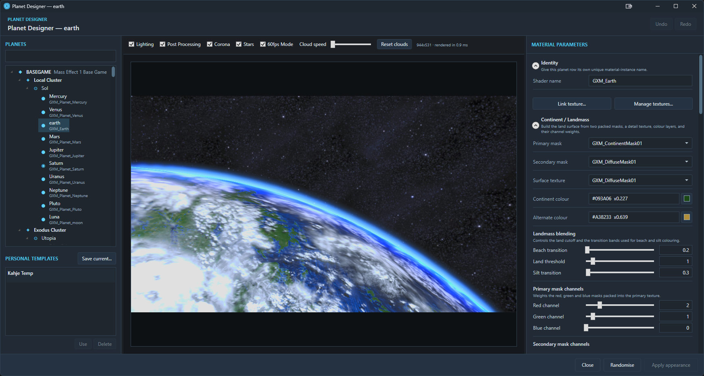
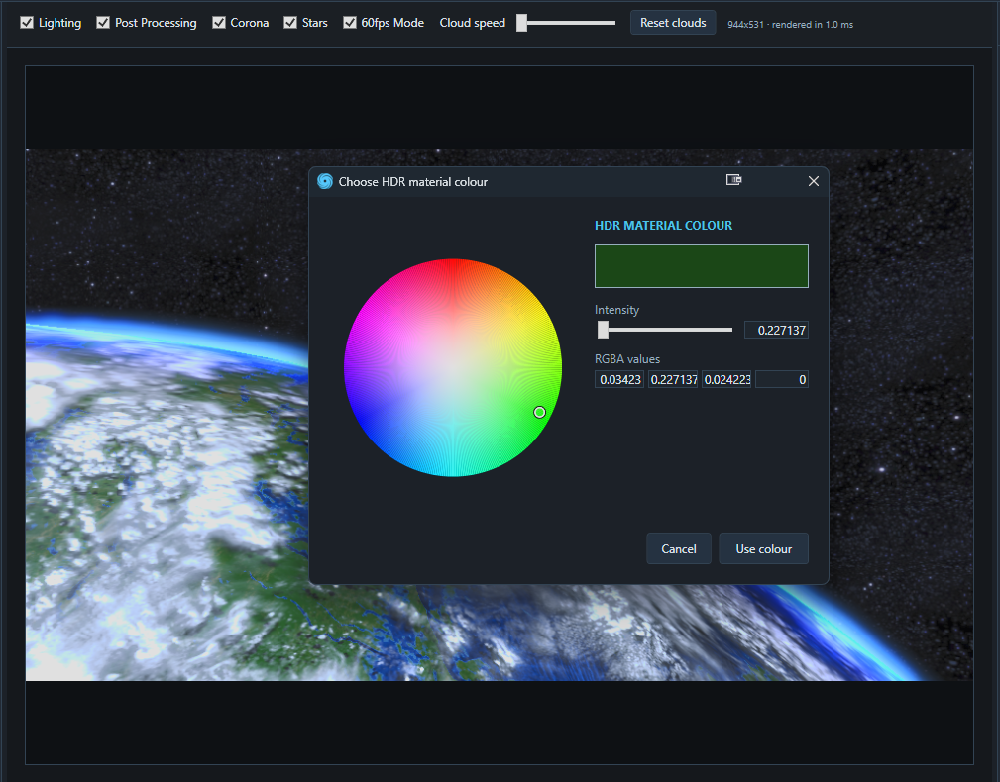
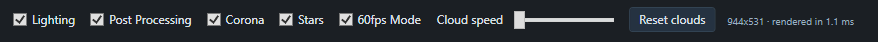
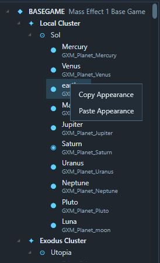
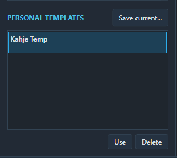

# Planet Designer

Planet Designer edits the material appearance of landable planets. Its renderer reproduces the LE1 result with almost perfect visual accuracy, making it suitable for confident appearance authoring before an in-game check.

## Open Planet Designer

Double-click an eligible planet in the hierarchy or System map, or use **Open Planet Designer...** from its context menu.

Planet Designer is only available for planet types that support the planet preview in-game, so Asteroid Belts and Anomalies are excluded.

Only one Designer window is used. Opening another planet brings that window forward and changes its target.

## The three panes

| Pane | Purpose |
|---|---|
| **PLANETS + PERSONAL TEMPLATES** | Finds appearance-capable planets and saved personal templates. |
| **LIVE PLANET PREVIEW** | Displays the current planet material in a fixed 16:9 view. |
| **MATERIAL PARAMETERS** | Edits Shader, textures, scalars, mixers and colours. |

Drag the dividers to resize the panes. The resolution of the planet preview will adapt to the overall size of the window/panes.

The planet tree groups rows by module, Cluster and System. Its search checks module names, Cluster/System/planet names, Row IDs and Shader names.

## Draft, Apply and Commit

Planet Designer has two stages of editing:

1. **Material Parameters**, **Copy/Paste Appearance**, and **Randomise** change the Designer's private draft and preview.
2. **Apply appearance** adds that draft to the shared, undoable workspace changes.
3. The main-window **Commit** writes the change to the module files.

Closing the Designer or switching planets with an unapplied draft offers **Apply**, **Discard** and **Cancel**.

Applying appearance creates one Undo entry, regardless of how many material controls changed. Shared Undo and Redo can affect changes made elsewhere in the application.

Designer Undo/Redo operates on applied workspace changes, not individual draft inputs. Apply or discard the current draft before using it.

## Material groups

The controls are divided into nine groups:

1. **Identity**
2. **Continent / Landmass**
3. **Normals**
4. **Ocean**
5. **Beach / Silt**
6. **City Emissive**
7. **Atmosphere / Horizon**
8. **Corona**
9. **Lights**

Hover over a control for its parameter description.

### Link a module texture

Choose **Link module texture...** below Identity to add a custom texture. Enter its full in-memory seek-free reference, select one or more menus where it should be available (**Continent**, **Normals**, **Ocean**, **City Emissive** or **Atmosphere**), then browse for the local preview image.

The editor stages the image under the module's `textures` folder and records the relationship in `module.json`. The local filename is deliberately independent from the in-memory reference written to `GalaxyMap_Planet.csv`. Editing that reference later in the Planet 2DA table updates the metadata relationship without renaming or losing the staged image.

## Control types

| Control | Use |
|---|---|
| Shader text | Sets the planet's unique material-instance name. |
| Texture drop-down | Selects a bundled texture or preserves a typed texture reference. |
| Slider and number | Adjusts a scalar value with coarse or precise input. |
| Three-row mixer | Blends related material channels. |
| HDR colour picker | Sets colour and brightness values beyond ordinary screen colour. |
| Packed colour picker | Edits a signed ARGB value using a colour wheel or numeric channels. |

The packed colour picker accepts `#AARRGGBB` or ARGB channel values from 0–255. Cancelling either colour picker restores the value it had when the picker opened.

## Preview controls

| Control | Effect |
|---|---|
| **Lighting** | Toggles preview lighting. Off is the equivalent of `viewmode unlit` |
| **Post Processing** | Toggles the colour correction & bloom pass. |
| **Corona** | Toggles the planet corona. |
| **Stars** | Toggles the star background. |
| **60fps Mode** | Uses smoother preview updates for the cloud animation. Off changes to `18fps` |
| **Cloud speed** | Changes the preview animation speed. |
| **Reset clouds** | Restarts cloud animation from its initial position. Will not reset any material params. |

The preview uses a fixed camera that matches the in-game view. It does not pan, rotate or zoom.

## Preview textures and rendering

Bundled texture references render directly. Linked module textures use their staged local image immediately, including before Commit. An unknown, unlinked custom texture reference is preserved in the data but displayed with a fallback texture in the preview.

Check the **fallback textures** detail when the preview does not match your intended custom asset.

The renderer uses hardware acceleration where available and automatically tries software rendering if necessary. If neither mode starts, the pane reports **Preview unavailable**; parameter editing remains available.

## Copy and paste appearance

Right-click any planet in the tree and choose **Copy Appearance**, then use **Paste Appearance** on your target.

This is an internal application clipboard rather than the Windows clipboard. Pasting replaces the target's draft material values but preserves its own Shader name.

Switching the selected planet does not copy appearance by itself.

## Randomise appearance

Choose **Randomise** to create a guarded variation of a BASEGAME planet material. This 

The status bar identifies the donor planet and generation seed. The system is designed to pick a basegame planet and then randomise various aspects of its appearance with a roughly 35% variation. This allows them to maintain consistency with vanilla while providing you with interesting variations to base more extensive edits on.

Linked custom Planet textures from mounted modules participate in randomisation. Each texture is considered only for the material categories selected when it was linked, and each compatible texture slot has a 35% chance to use a custom option when one is available.

Choose **Manage textures...** below Identity to inspect linked textures, their module, categories, availability and current Planet-row reference count. **Unlink selected** removes the relationship from writable module metadata and immediately removes it from randomisation and selectable dropdown options.

When a linked texture is missing and no staged copy is available, the Designer marks the relationship unavailable and excludes it from dropdowns and randomisation. Use **Manage textures...** to unlink the stale relationship or relink the same in-memory path to a replacement preview image.

## Personal templates

Choose **Save current...** to open **Save Planet template**. Enter a unique template name.

Templates save appearance settings without the Shader name. This prevents two planets from accidentally receiving the same material-instance identity. 

Apply a template by double-clicking it or selecting **Use**. Deleting a personal template is immediate and has no confirmation prompt.

Personal templates are stored in `%LocalAppData%\LE1GalaxyMapEditor\PlanetTemplates`.

## Shader names

Every changed planet-row version must have a non-empty Shader name that is unique across the mounted workspace. While vanilla LE1 supports multiple shader name instances, for in-memory safety it is blocked for editable modules.

When applying an appearance to an inherited BASEGAME planet, the editor asks which writable module should receive it and may open **Choose Planet Shader name**.

Commit is blocked if a changed Shader is blank or duplicates another planet-row version. Use a stable naming convention containing your module tag and planet identity.

## Shortcuts

| Shortcut | Result |
|---|---|
| **Ctrl+S** | **Apply appearance** |
| **Ctrl+Z** | Shared staged Undo |
| **Ctrl+Y** | Shared staged Redo |
| **Esc** | Close, with a prompt for an unapplied draft |

## See also

- [Galaxy Map Editor](GALAXY-MAP-EDITOR.md)
- [Validation and Errors](VALIDATION-AND-ERRORS.md)
- [Known Limitations](KNOWN-LIMITATIONS.md)
