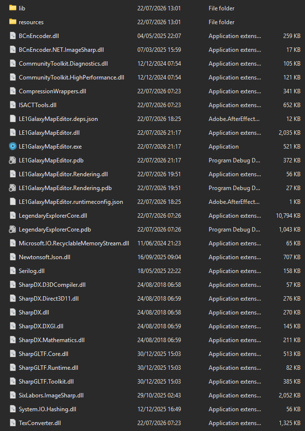

# Troubleshooting

Most launch and editing problems come from an incomplete extraction, a missing runtime, a moved DLC or a PCC locked by another program.

If you spot any other issues, please let me know either with a Discord DM or by opening an Issue here on Github.

## The application does not start

### Install .NET 10

LE1 Galaxy Map Editor requires 64-bit Windows 10/11 and the [.NET 10 Desktop Runtime](https://dotnet.microsoft.com/download/dotnet/10.0).

Install the x64 Desktop Runtime, then launch `LE1GalaxyMapEditor.exe` again. The developer SDK is not required.

### Extract the complete release

Do not move the executable out of the extracted folder by itself. It needs the adjacent DLLs and `resources` folder.

If the error mentions missing BASEGAME data or `resources\data`, extract a fresh copy of the complete release archive.

## Find the startup log

Startup logs are stored in:

`%LocalAppData%\LE1GalaxyMapEditor\Logs`

The latest ten logs are retained. If startup fails, the error window normally includes the path of the saved log.

Include the newest log when reporting a repeatable startup problem.

## A remembered module is missing

The application remembers mounted profile IDs in:

`%LocalAppData%\LE1GalaxyMapEditor\workspace.json`

The corresponding module profiles are stored in `%LocalAppData%\LE1GalaxyMapEditor\modules`. If a DLC or its galaxy-map PCC has moved, BASEGAME remains available and the editor reports the missing path.

Try the following:

1. Restore the DLC to its previous path, or use **Open Module** to select the PCC at its new location.
2. Choose **Refresh** after the PCC is available.
3. If a stale entry continues to return, close the application and rename `workspace.json` to `workspace.backup.json`.
4. Relaunch the editor and reopen the required modules.

Renaming or deleting the workspace file resets remembered links; it does not delete profiles, PCCs or other DLC files.

## I cannot edit a row

Check the module bar:

- You need at least one writable module.
- New rows require an active writable module.
- Clicking a module chip only opens its settings; choose **Set as Active** there.
- BASEGAME rows are changed through an override, not edited directly.

Use **New Module** to create a galaxy-map PCC in an existing DLC. If a **Choose edit module** window appears, select the writable destination for the override.

## A module will not open

Check that:

- the selected file exists and has a `.pcc` extension;
- the PCC is directly inside a folder named `CookedPCConsole`;
- the parent DLC folder contains `AutoLoad.ini`;
- `[ME1DLCMOUNT]` contains a non-empty `ModName` and a non-negative integer `ModMount`;
- the DLC folder name uses only letters, numbers, `_` or `-`;
- the PCC contains at least one uniquely named supported galaxy-map export, unless it was previously profiled as an intentionally empty module;
- the same DLC tag/PCC identity is not already linked to another live installation.

If a previously linked PCC moved with its DLC, choose **Open Module** at the new location to relink the profile. Use **Forget Module** only when you also want to remove its editor-owned settings.

## New Module cannot create the PCC

The destination must be a new `.pcc` directly inside an existing DLC's `CookedPCConsole` folder. The DLC must already have a valid `AutoLoad.ini`. The destination cannot already exist, and each reserved range must either have both bounds or be blank. Ranges cannot overlap another module's reservation or existing IDs in BASEGAME and lower-mounted modules.

## The wrong row is effective

Check `ModMount` in each DLC's `AutoLoad.ini`. The highest-priority version of the same table and Row ID becomes effective; the editor displays this value as the module priority but does not edit it.

Keep DLC mount values unique. Use the module-instance tabs in **PROPERTIES** to compare every module version of the selected row.

After changing files outside the application, choose **Refresh**.

## Commit fails

Common causes include:

- the galaxy-map PCC is open or locked by another program;
- the PCC or `CookedPCConsole` folder is read-only;
- the DLC is unavailable or has moved;
- the PCC changed outside the editor after it was loaded;
- security software is temporarily scanning or locking the temporary or replacement package;
- a changed Planet Shader is blank or duplicates another planet-row version.

Close other programs using the PCC, or choose **Refresh** if it changed externally. Correct the reported issue and choose **Commit** again.

The editor writes and verifies a temporary PCC before replacing the original. If earlier modules were saved before a later failure, only the remaining unsaved changes stay on the module bar for retrying.

## Planet preview is unavailable

Planet Designer first attempts hardware rendering and then software rendering.

If both fail:

1. Update the graphics driver.
2. Confirm that the complete release, including rendering DLLs and Planet Designer resources, was extracted.
3. Restart the application.
4. Continue editing parameters if necessary; the Designer remains usable when its preview is unavailable.

## The preview shows fallback textures

Planet Designer renders its bundled texture library and textures resolved from the active galaxy-map PCC or registered resource PCCs. Unknown custom texture references are preserved but use a fallback image in the preview.

Open the **fallback textures** detail to identify them. In the module settings, register the same-DLC PCC containing the required `Texture2D`, then verify the in-memory package path.

## Refresh or Discard did not reload

When a required mounted module cannot be reloaded, the editor keeps the current in-memory workspace so that your uncommitted work is not silently lost.

Restore the missing DLC/PCC or correct the module error, then try **Refresh** or **Discard** again.

## Unlink did not delete the module

This is expected. **Unlink Module** removes the profile from the current workspace but never deletes the profile or files from disk. **Forget Module** deletes only the editor profile.

Delete or archive DLC content separately only after checking that it is no longer needed.

## The module does not appear in game

LE1 Galaxy Map Editor writes the galaxy-map 2DA exports directly in the selected PCC, but it does not install or enable the containing DLC.

Ensure the DLC is installed and enabled through your normal ME3Tweaks Mod Manager workflow. Custom textures and TLK strings must already exist in suitable DLC PCCs; registering a resource PCC or selecting a TLK locale does not modify them.

See [Known Limitations](KNOWN-LIMITATIONS.md) for the full boundary of the editor's responsibilities.
