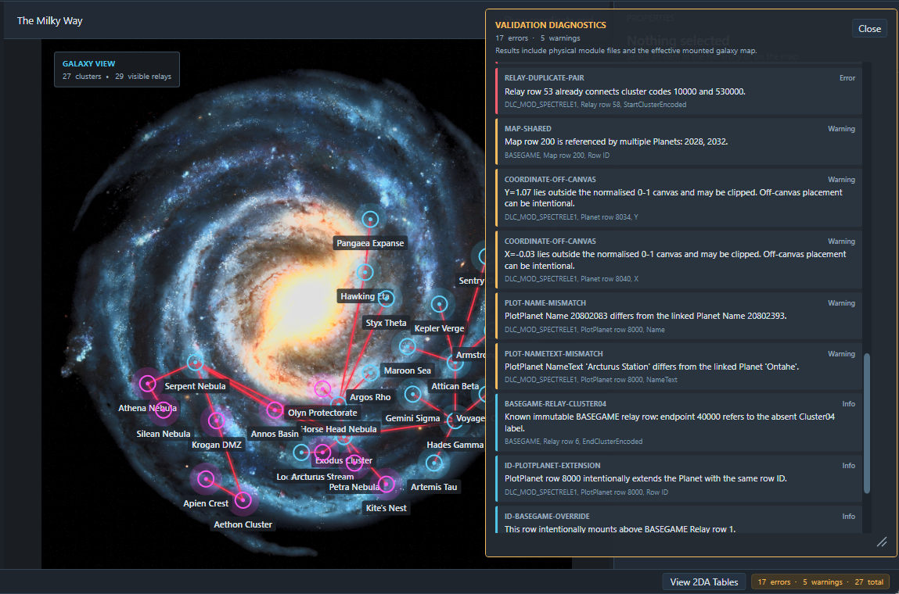
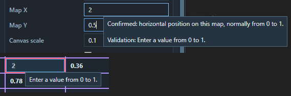
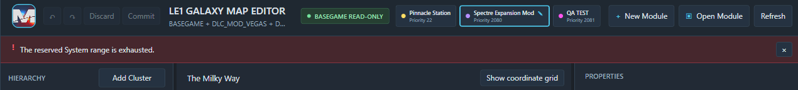

# Validation and Errors

The editor reports problems close to where they occur and also maintains a workspace-wide diagnostic list.

## Three kinds of feedback

| Feedback | Purpose |
|---|---|
| Inline field or cell error | Explains why the current value cannot be applied. |
| Red error banner | Reports an operation that could not be completed. |
| **VALIDATION DIAGNOSTICS** | Lists ongoing issues found across module files and the effective map. |

Dismissing the red banner does not remove entries from **VALIDATION DIAGNOSTICS**.

## Severity colours

| Severity | Colour | Meaning |
|---|---|---|
| Error | Red | Invalid or conflicting data that should be corrected. |
| Warning | Amber | Suspicious or unsupported data requiring review. |
| Info | Accent/cyan | Useful context that may not require a change. |

The footer summarises current errors and warnings. Open the panel to see each diagnostic code, message and location.

## Use the diagnostics panel

- Drag the panel by its header to move it.
- Drag its bottom-right corner to resize it.
- Choose **Close** to dismiss it.
- Click a row-linked entry to navigate to the affected object.

File-level or schema-level entries may not have a specific row to select. If you are currently viewing 2DA tables, a diagnostic can select the underlying map row without switching back to **View Galaxy Map**.

The panel closes automatically when no diagnostics remain.

## What validation checks

Validation covers areas including:

- Row IDs and reserved ranges;
- overlapping or conflicting module rows;
- expected table columns and ordering;
- missing Cluster, System, Planet, PlotPlanet, Map or Relay relationships;
- numbered labels and ActiveWorld values;
- coordinates, scale and type values;
- availability settings;
- Relay endpoints and duplicate connections;
- PlanetLevelType values known not to work correctly in LE1.

The panel checks both individual module rows and the effective map. A lower-priority problem can therefore remain listed even when a higher module supplies a valid effective value.

## Correct an inline error

Invalid inspector fields and 2DA cells receive a red border and explanatory tooltip.

1. Read the tooltip.
2. Correct the selected value.
3. Press **Enter** or move focus away to apply it.

An invalid edit does not create an Undo entry.

## Diagnostics and Commit

The general diagnostic list is advisory. **Commit** is not disabled merely because the list contains an error.

Resolve reported errors before packaging or testing your mod. A value can be serialisable in a PCC while still being unusable or unsafe in LE1. The galaxy 2DA system is documented but not extensively stress tested for edge cases.

Changed Planet Shader values have an additional commit-time check. Each must be non-empty and unique across all mounted planet-row versions; Commit is blocked until those Shader problems are corrected.

## If Commit fails

For each changed module, the editor writes a temporary PCC, reloads it, verifies the requested tables and confirms that the original PCC has not changed externally before replacing it.

If a later module or editor-profile update fails, earlier modules may already have been written successfully. Their changes are cleared, while the remaining unsaved changes stay available.

1. Read the red error banner.
2. Close anything that may have locked the galaxy-map PCC.
3. Check that the PCC and its `CookedPCConsole` folder are writable and available.
4. Choose **Commit** again to write the remaining changes.

Undo/Redo history is cleared after a partially successful Commit because some changes are already on disk.

## Common warnings

- A relationship points to a missing or incompatible row.
- A new ID is outside its module's reserved range.
- A reserved range overlaps another range or an existing lower-layer row ID.
- Coordinates or scale are outside expected values.
- `PlanetLevelType` is 3, 5 or 7; these values are known not to work correctly in LE1.
- A Relay is incomplete, duplicated or resolves to an invalid Cluster.

For fixes to launch, module-loading or rendering problems, see [Troubleshooting](TROUBLESHOOTING.md).
