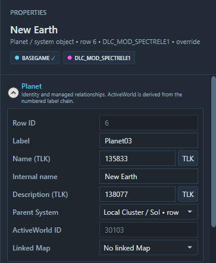
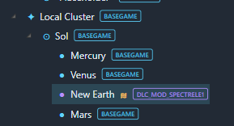
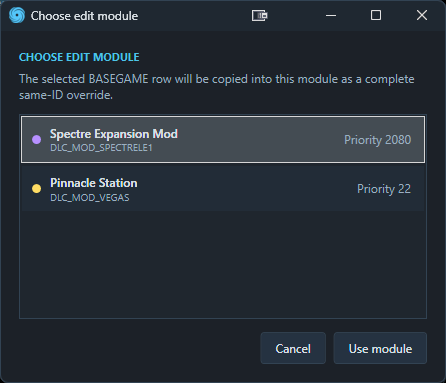
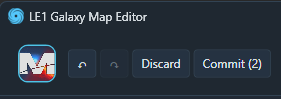

# Workspace and Modules

The workspace lets you view BASEGAME and several mod modules together while keeping their files separate.

## Key terms

| Term | Meaning |
|---|---|
| BASEGAME | The built-in, read-only LE1 galaxy-map data. |
| Writable module | A module the editor can update. |
| Active module | The currently active module that edits will apply to by default. |
| Override | A complete row with the same table and Row ID as a lower source row. |
| Effective row | The version currently used after module priority is applied. |
| Module profile | Editor-only display, colour, locale, resource-PCC and reservation settings stored outside the DLC. |
| Uncommitted change | An edit held in memory but not yet written through `Commit`. |

## Priority and row overrides

Each module has a **Mount priority**. When several modules contain the same table and Row ID, the highest-priority version becomes effective.

Each module's priority comes from `ModMount` in its DLC's `AutoLoad.ini`. Use unique mount values and avoid giving two authoring modules the same Row ID unless you deliberately intend one to replace the other. An intentional higher-layer same-ID row is reported as an informational override.

The active module and the highest-priority module are separate concepts. Making a module active does not move it above other modules.

If two modules edit the same instance, it will display `≋` in the hierarchy. Use the module-instance tabs at the top of **PROPERTIES** to compare them.

## Module indicators

| Indicator | Meaning |
|---|---|
| **BASEGAME READ-ONLY** | Built-in game data; never written by the editor. |
| Module colour | Identifies rows and values originating from that module. |
| Pen on a module chip | The current active module. |
| Amber dot | The module has uncommitted changes. |
| `Priority [?]` | The module's current mount priority. |

Click a module chip to edit its settings. Use **Set as Active** when you want it to receive new content.

## PCC modules and editor profiles

**New Module** creates a writable galaxy-map `.pcc` directly inside an existing DLC's `CookedPCConsole` folder intended for use with ME3Tweaks Mod Manager's 2DA Merge feature. The containing DLC must have a valid `AutoLoad.ini`. The DLC folder name supplies the module tag, while `ModName` and `ModMount` supply its source name and mount priority.

**Open Module** links an existing galaxy-map PCC from the same layout. The editor reads any supported `Bio2DANumberedRows` exports directly.

Editor-only settings are stored in `%LocalAppData%\LE1GalaxyMapEditor\modules`, keyed to the DLC tag and PCC path. They include the display name, map colour, selected TLK locale, registered resource PCCs and reserved ranges. No `module.json` or other editor metadata is added to the DLC.

A PCC may contain any subset of the six supported tables. When creating a module, a blank reservation omits that table export. If the range is added later and the table gains authored rows, Commit imports the required empty 2DA export from the shipped template before writing it.

Use **Unlink Module** to remove a module from the current workspace without deleting its profile or DLC files. Use **Forget Module** to unlink it and delete only its editor profile; every DLC file remains untouched.

## Reserved ID ranges

Reserved ranges control which IDs a writable module can allocate for new content. Starts and ends are inclusive.
IDs are the numbered row names stored by the 2DA export and shown in the first column of the table editor.

Separate ranges are available for:

- Cluster;
- System;
- Planet / PlotPlanet;
- Map;
- Relay.

Leave both fields blank when the module will not create rows in that table. Reserved ranges cannot overlap another module's range or IDs already supplied by BASEGAME or a lower-mounted module. A range cannot be changed so that it excludes rows the module has already created.

If you attempt to perform an edit that requires creating rows that are marked blank in your module, it will not let you until you specify a range. This is to prevent accidental row creation. This does not apply to adding basegame row overrides, however.

Blank ranges omit those table exports from a newly created PCC. If you add a range later and author content for that table, Commit creates the required export through Legendary Explorer Core before writing the rows.

## Choosing where an edit goes

The destination depends on the row and editor surface:

- A writable module's existing row continues to edit in that module.
- Editing a BASEGAME row through **PROPERTIES** asks you to **Choose edit module**.
- Applying a Planet Designer appearance to a BASEGAME row also asks for a module.
- Editing an inherited 2DA cell uses the active module when one is available; otherwise it asks you to choose.
- New Clusters, Systems, planets and system objects use the active module.

The editor creates a complete same-ID row in the chosen module. The lower source row remains unchanged.
This same-ID override does not need to be inside the destination module's reserved range. It is valid whenever the destination module mounts above the row it is overriding; reservations apply only to genuinely new IDs.

## Shared uncommitted changes

The Galaxy Map Editor, 2DA Table Editor and Planet Designer share edit memory.

| Control | Result |
|---|---|
| **Undo** | Reverses the most recent staged change, regardless of which editor made it. |
| **Redo** | Restores the most recently undone change. |
| **Discard** | Reloads the committed workspace and removes every uncommitted change. |
| **Commit (?)** | Reviews, then writes all uncommitted changes across all writable modules. |
| **Refresh** | Reloads BASEGAME and remembered modules; asks before discarding pending work. |

Commit's number counts groups of changed data, not rows or individual field edits.
Example: If you move the position of an object on the map, it will appear as `Commit [2]` as the X and Y column data was edited.

Choosing **Commit** opens a fixed-size review window before anything is written. It lists changed 2DA fields with their committed and staged values, identifies new or deleted rows, and includes profile and workspace changes. New rows are kept compact, showing their internal name and tree relationship rather than every added field. Long lists scroll within the window. Choose **Commit changes** to continue or **Cancel** to leave every change staged.

Undo and Redo history is shared and limited. It is cleared after Commit, Discard, Refresh or Unlink Module.

## Commit and recovery

For each changed module, Commit writes and reloads a temporary PCC, verifies the requested tables, checks that the source package has not changed outside the editor, and then replaces the original package. Separate modules and profile/workspace updates remain separate commit boundaries.

If a later module cannot be written, earlier modules may already have been saved. The remaining changes stay available so you can resolve the problem and choose **Commit** again.

Closing the application with uncommitted changes offers **Commit**, **Discard** and **Cancel**.

## Refresh and Unlink Module

**Refresh** reloads the workspace modules from disk. If you have uncommitted changes, the editor asks before removing them.

**Open Module** and **Unlink Module** update the live module stack immediately, but the corresponding profile addition or removal from `workspace.json` remains staged until **Commit**. The Review changes window lists these workspace additions and removals. Cancelling the review leaves them staged, while **Discard** restores the remembered module stack.

**Unlink Module** never deletes the PCC, profile or any DLC file. **Forget Module** additionally removes the editor profile. Any other uncommitted changes for that module are discarded and the shared Undo/Redo history is cleared.

Deleting an override has a similar layering effect as unlinking a module: the lower-priority version becomes visible again rather than being deleted.

## See also

- [Getting Started](GETTING-STARTED.md)
- [2DA Table Editor](2DA-TABLE-EDITOR.md)
- [Validation and Errors](VALIDATION-AND-ERRORS.md)
- [Known Limitations](KNOWN-LIMITATIONS.md)
